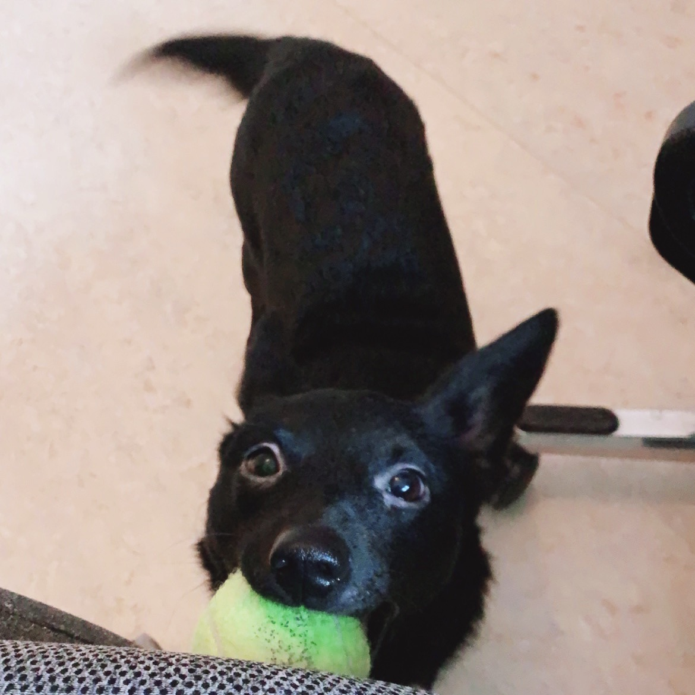

# a useless site
Inspired by my dog

The assignment was to build a useless website using only HTML, CSS and JavaScript. No third party libraries such as jQuery or React was allowed.

## Installation

Clone the repository to your computer

```
$ git clone https://github.com/carolinahagman/a-useless-site.git
```

Open index.html in your preferred browser

Or open the live verison [here](https://throw-the-ball.vercel.app/)

## My check list

### styling

- [x] create tennis ball
- [x] button for raining balls
- [x] background gradient
- [x] Flora

### template

- [x] add constant elements (flora img, button, the original ball)

### script

- [x] click and drag ball around
- [x] verify it works on both mobile and desktop
- [x] make flora move
- [x] make flora move in direction of ball
- [x] set boundaries for the ball
- [x] when flora catches ball, play sound
- [x] when button is pressed, create many balls
  - [x] make the balls random colors
  - [x] randomize position
  - [x] randomize velocity
  
  ### backlog
  - [ ] ball should maintain velocity when "thrown"
  - [ ] bounce in a mirrored direction

## Author

- Carolina Hagman

## Testers

-
-
